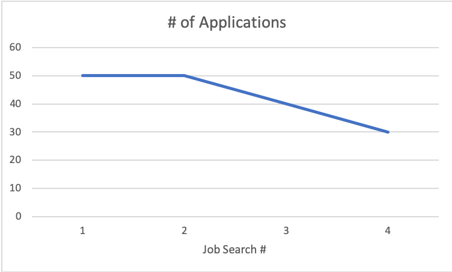
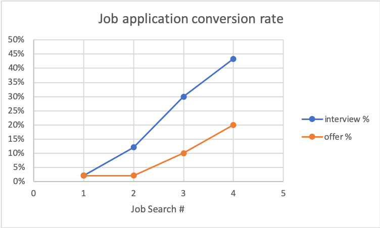

# Getting your first internship is HARD

> How you have you found success in your interviews?

I received this question in responses to a [post I made](https://www.linkedin.com/posts/havinleung_uwaterloo-universityofwaterloo-internship-activity-6644332348458577920-FTfL). Instead of answering it directly, I want to take a step back and answer a broader question which includes.

> How did you get your internships?

The short answer is **repeated failures** and **learning from your failures**. At the time of writing this article, I've completed 5 internships and failed many, many times. Let me show you what I mean.

## What do you mean by repeated failures?

In my opinion, there are 2 kinds of failure related to internship/job searching. There's failing to *get the interview*, and then there's failing to *pass the interview*. I've done both of these plenty of times. I can quantify these failures with some personal statistics.

## Job searching statistics

**1st internship**: I *applied to 50 jobs* (the maximum amount for the 1st round of my university's job board). Most of these jobs had low requirements, and some of them weren't even tech related. I only *got 1 interview*, and to one of the non technical jobs. Luckily, I aced it and got the job.

**2nd internship**: I *applied to 50 jobs*, mostly tech related. About half were developer roles, half were QA and other stuff. I *got 6 interviews*. I failed most of the interviews and only *received 1 offer*.

**3rd internship**: I *applied to 40 jobs*, all software developer roles. I *got ~12 interviews* and *received 3-4 offers*.

**4th internship**: Google host matching came through before I participated in the big job search.

**5th internship**: I *applied to 30* software developer jobs, and only at well known companies. Think of big names like Snap, Uber, Microsoft, Facebook, etc... I had a whopping *13 interviews* (13 companies, but most of them had at least 2 rounds of interviews). I *received 6 offers*.

In the very beginning, I had abysmal conversion rates! Only 2% of my applications turned into interviews/offers. After a few internships, lots of failure, and lots of learning, my interview conversion rate is now above 40%, and my offer rate is 20%.

One thing that I couldn't quantify (easily) is that the types of jobs I applied to got more and more "prestigious" with each successive internship search. This means that if I applied to the same type of companies for each job search, the difference would be *even more pronounced*.

**Key Takeaway**: Job searching gets *much easier* with time and experience, but the first one is *really hard to get*