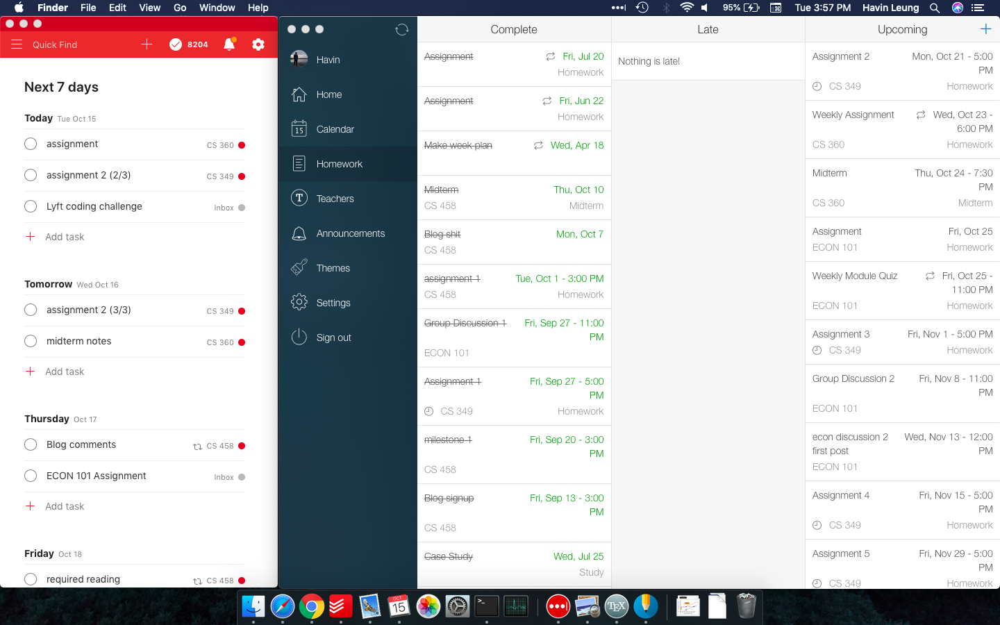
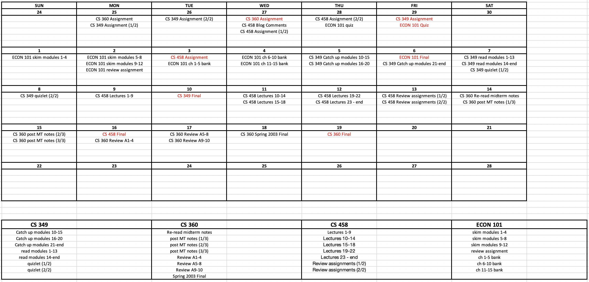

# How to study - A guide for struggling students

## Preface

I initially wrote this guide after my first year, where I learned (the hard way) that time management is the key to academic success. I was *absolutely miserable* during my first year, and I see many students struggling with the same thing. I wish I had somebody tell me how to *study effectively* and *manage my time*, so I'll write down my advice for any future struggling students. All the tips I'm going to give you are actionable and give tangible results.

Why should you listen to me and my advice? Simple - I'm a high achieving student in a difficult program at a difficult university. My cumulative average is 93%, I've gotten the highest mark in my engineering cohort, and I've been in Computer Engineering, Software Engineering, and Computer Science - the 3 most "prestigious" programs for software at the University of Waterloo.

## Why time management is so important

If you've ever missed a deliverable or had to do something last minute, you were the victim or poor time management and organization! It's really hard to get good marks and balance out your time if you don't even know what's due and when.

You need to be able to keep up with assignments, labs, tests, etc... Unless you're naturally gifted as hell, you're going to have to learn how to plan out your time. I will describe the method that has worked for me.

## My Method

### The apps

I use 2 apps for the bulk of my time management. I use [myHomework](https://myhomeworkapp.com/) to keep track of all deliverables for all of my classes - this is the master list of everything I need to do. I also use [Todoist](https://todoist.com/) but for a different purpose - this is my weekly/daily to-do list. Note that both of these apps are free, have web versions, and are android/iOS compatible. 

### Starting up

At the beginning of my semester, I download all of my classes syllabuses. Then I go through them one by one, adding *every single deadline* into myHomework. This includes assignments, lab reports, tests/quizzes, etc... (basically include every single deliverable). This list will be used to create every week's plan, and also to keep track of task completion.

Note that some classes may not include the specific date for every deliverable (might say TBD). What I like to do is write down all such deliverables in a todo note, and set a recurring weekly reminder to check the dates. This ensures that when the dates are announced, I stick them into myHomework quickly.

### Weekly plan

Once a week (I personally do this every Sunday), I write down what I have to do for the next 7-10 days. I open up myHomework and go to the calendar's weekly view and take note of what is due in the next 2-3 weeks. **Important note**: I always look at least 2 weeks ahead just because some big projects or exams take more than just 1 week to do. 

Now that you have all your deadlines in one app in the convenient weekly format, it's really easy to divide up your work and assign work to your self for every day of the week. For this to be effective, you'll need to be able to estimate how much work you need to put in each deliverable - this is a skill you'll develop as you do this more. Make sure that you're not overbooking yourself. If you don't have much free time on mondays, then write less down for monday. 

Now you have a concrete plan on how to tackle tasks and when to study for quizzes! This should make keeping up with your classes much easier and less stressful.

**Pro tips**: 
* Divide up assignments into chunks if they're too big to do in one sitting or you'd like to do more than 1 subject in a day
* Try to be generous when allocating time. Sometimes assignments have hiccups, some programs might have bugs, something might come up, etc...

**Examples**:

    Monday (Today):
    - Math 117 assignment #7 (1/2)
    - Review CHE 102 lecture #22
    
    Tuesday:
    - Math 117 assignment #7 (1/2)
    - ECE 140 - learn wtf polar numbers are and how to do AC analysis
    - ECE 105 lab report #3
    
    etc..

## My exam studying method

Now I want to touch on the topic of **studying for exams**. Many of you probably just try to memorize everything and plug and chug through exams. You probably don't have a good method of studying and you are simply throwing all of your time towards it without any strategy. This is the **wrong** way to study. 

For midterms, I generally start this process *a week* before my first midterm. For finals, I start *2-3 weeks in advance*. Write down a big ass to-do list for each course you have an exam for. For each course, write down tasks that you will need to complete in order to successfully complete the exam. Then, we just do the same method as before - make yourself a to-do list for every day. 

**Note**: For this exam period, I like to do a calendar style to-do list as opposed to using Todoist since I'm planning so far in advance.

### What's on my exam to-do list?

What you need to study to be able to do an exam depends heavily on the course. I study differently depending on if the course is application/concept heavy as opposed to memorization/knowledge heavy.

For application/concept heavy courses, I personally do at least:
* make a high level summary of all my notes and important concepts
* re-do past assignments (especially problems that you messed up)
* previous exams/practice exams

For memorization/knowledge heavy courses:
* re-write my notes, especially definitions that may be tested
* study with flash cards

**examples**:

    ECE 105 (Classical Mechanics):
    - Summarize Unit 1-4
    - Summarize Unit 5-8
    - Summarize Unit 9-whatever
    - Re-do assignment 3
    - Review assignments 4-6
    - Do 2015 final

**Pro tip**: Don't just plug and chug the previous exams. Do one and analyze your mistakes, learn from them, etc.. before doing the next one. There's *no point* in doing them if you don't learn from your mistakes.

## Stress and mental health

The last topic I'd like to cover is the topic of **stress and mental health**. This is a sensitive one, and I definitely do not have all the answers. However, some things have definitely helped me and may help you. (note: if you are extremely depressed, I'd recommend counselling and talking more to your friends/family)

Try to exercise regularly. Exercise lets you de-stress and focus better on your work. **It's better to "lose an hour" in order to exercise before studying simply because it will make you study better**. Just trust me and do some exercise, whether it be lifting weights, going for a jog, doing yoga, whatever. Just get your body moving and your blood flowing. Thank me later.

Eat healthier. Drink more water. Sleep more. Your brain does not function well on 2 large pizzas, 14 coffees, no water and 3 hours of sleep (I did this in my first semester. All that accomplished was make me fat and stressed and depressed). You will just be throwing your time at the problem and not actually making any progress.

Take study breaks! A 5-10 minute break every 20-30 minutes will let you come back feeling refreshed and ready to study more. Again, I want to emphasize that you want to study effectively, not just throw all your time at the problem.

One last thing: Although your profs seem to hate you and want to make you fail, they are not all bad people. Some of them are extremely helpful if you reach out to them by email or during their office hours. There are also TA's you can ask. You can even ask your friends.

Hope this helps anybody in need.